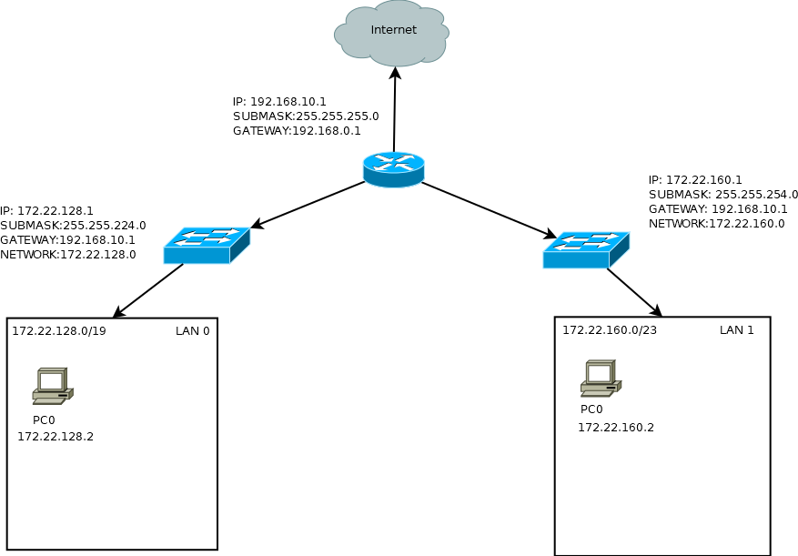

Zadanie 1
---------

1. Zaprojektuj oraz przygotuj prototyp rozwiązania z wykorzystaniem oprogramowania ``VirtualBox`` lub podobnego. 
Zaproponuj rozwiązanie spełniające poniższe wymagania:
   * Usługodawca zapewnia domunikację z siecią internet poprzez interfejs ``eth0`` ``PC0``
   * Zapewnij komunikację z siecią internet na poziomie ``LAN1`` oraz ``LAN2``
   * Dokonaj takiego podziału sieci o adresie ``172.22.128.0/17`` aby w ``LAN1`` można było zaadresować ``500`` adresów natomiast w LAN2 ``5000`` adresów    
   * Przygotuj dokumentację powyższej architektury w formie graficznej w programie ``DIA``

Rozwiązanie  
-----------

### Zapewnienie dostępu do sieci poprzez interfejs eth0(``enp0s3``)

> echo 1 | tee /proc/sys/net/ipv4/ipforward
>
>iptables -t nat -A POSTROUTING -o enp0s3 -j MASQUERADE

### Adresacja IP

|     LAN 0      |      LAN 1     |
|----------------|----------------|          
|172.22.128.0/19 |172.22.160.0/23 |
|    8190 host   |     510 host   |

>ip addr add 172.22.128.1 dev enp0s8 --> dla eth1
>ip addr add 172.22.160.1 dev enp0s9 --> dla eth2

### Ip route

##### Dla sieci LAN0
>ip route add default via ``172.22.128.1``

##### Dla sieci LAN1
>ip route add default via ``172.22.160.1``

Konfiguracja pernamentna
------------------------

### Dla PC0

#### eth1 (``enp0s8``)
W ``/etc/sysconfig/network-scripts`` tworzę plik ifcfg-enp0s8 i uzupełniam go
  
  DEVICE=enp0s8
  
  IPADDR=172.22.128.1
  
  NETMASK=255.255.224.0
  
  NETWORK=172.22.128.0
  
  BROADCAST=172.22.159.255
  
  ONBOOT=yes
 
#### eth2 (``enp0s9``)
W ``/etc/sysconfig/network-scripts`` tworzę plik ifcfg-enp0s9 i uzupełniam go
  DEVICE=enp0s9
  
  IPADDR=172.22.160.1
  
  NETMASK=255.255.254.0
  
  NETWORK=172.22.160.0
  
  BROADCAST=172.22.161.255
  
  ONBOOT=yes
  
### Dla PC1 
Konfiguruję analogicznie do przykładu powyższego, a ponadto plik ``etc/sysconfig/network`` uzupełniam adekwatnie do sieci. Dla LAN0 bramą będzie ``172.22.128.1`` a dla LAN1 będzie to ``172.22.160.1``

  NETWORKING=yes
  
  FORWARD_IPV4=yes
  
  HOSTNAME=PC0.test
  
  DOMAINNAME=test
  
  GATEWAY=172.22.128.1
  
  GATEWAYDEV=enp0s3

Dokumentacja architektury
-------------------------

